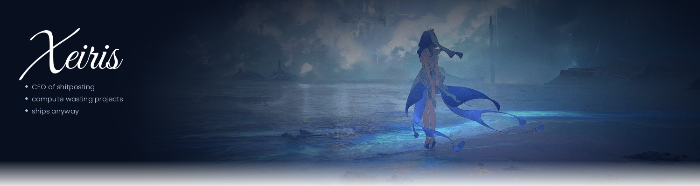

<!-- ═══════════════════════════════════════════════════════ -->
<!--                     BANNER                            -->
<!-- ═══════════════════════════════════════════════════════ -->

  

 

<!-- ═══════════════════════════════════════════════════════ -->
<!--                  STATUS + VIBE                        -->
<!-- ═══════════════════════════════════════════════════════ -->

> 🟢 &nbsp;**actively breaking things** &nbsp;·&nbsp;😭🙏claudee please i needd this..my code is kinda brokenn...&nbsp;·&nbsp; 🏎️MV1
 

<!-- ═══════════════════════════════════════════════════════ -->
<!--                     STACK                             -->
<!-- ═══════════════════════════════════════════════════════ -->

<h2 align="left">stack (honest edition)</h2>

**★ the ones I actually reach for:**

**the rest of the toolbox:**

 

<!-- ═══════════════════════════════════════════════════════ -->
<!--                    PROJECTS                           -->
<!-- ═══════════════════════════════════════════════════════ -->

<h2 align="left">notable experiments</h2>

<table>
  <tr>
    <td width="50%" valign="top">
      <h3>🤖 ai-something</h3>
      
Multi-model playground — no idea where it's going but it's going <em>somewhere</em>. Update: it went as a feature in Silverwolf bot.

      

        
        
        
        
      

      
    </td>
    <td width="50%" valign="top">
      <h3>Silverwolf Bot</h3>
      
Multipurpose shitpost Discord bot. Not safe for work & has gambling. Dockerized though.

      

        
        
        
        
      

      
    </td>
  </tr>
  <tr>
    <td width="50%" valign="top">
      <h3>🎮 Backrooms ReLoaded</h3>
      
A VR horror experience set in the backrooms. Honestly, too scary, never making shit like that again.

      

        
        
        
      

      
    </td>
    <td width="50%" valign="top">
      <h3>🚀 SCi Fi Shooter</h3>
      
Fly around a jetpack in an alien-occupied base. Find the keycard to escape. Oh and the barrels are destructable :>

      

        
        
        
      

      
    </td>
  </tr>
</table>

 

<!-- ═══════════════════════════════════════════════════════ -->
<!--              QUOTE + SNAKE + SOCIALS                  -->
<!-- ═══════════════════════════════════════════════════════ -->

> *"it compiles. ship it."*

 

  

 

<h2 align="left">find me</h2>

  
  &nbsp;
  
  &nbsp;
  

 

<!-- ═══════════════════════════════════════════════════════ -->
<!--                   GITHUB STATS                        -->
<!-- ═══════════════════════════════════════════════════════ -->
<h2 align="left">Stats for nerds</h2>

  
  &nbsp;&nbsp;
  

<!-- footer wave -->

  

