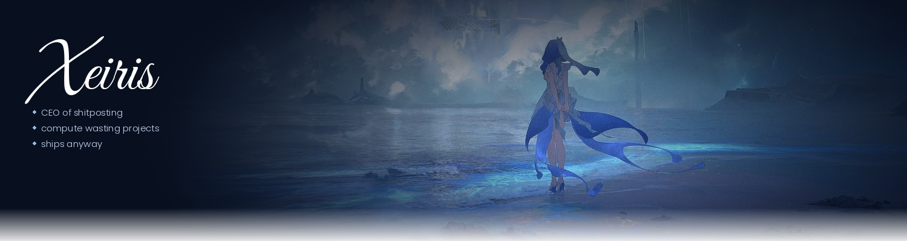
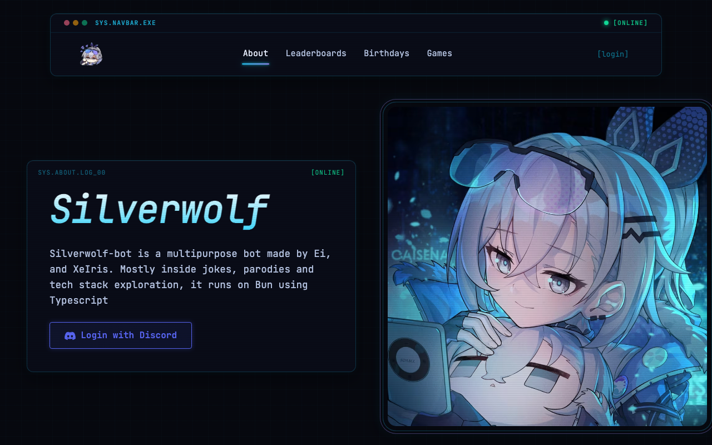
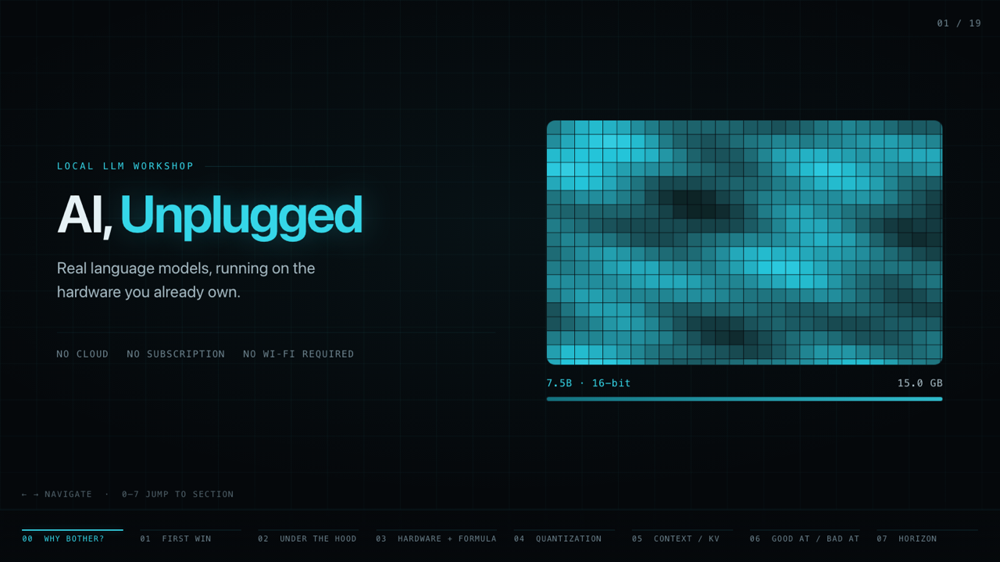
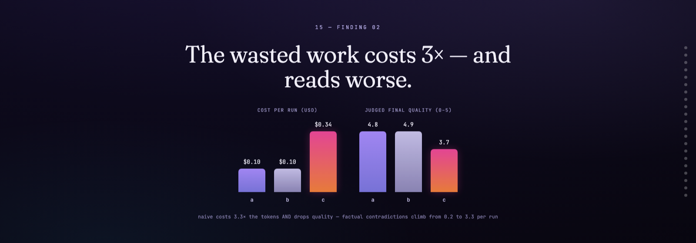
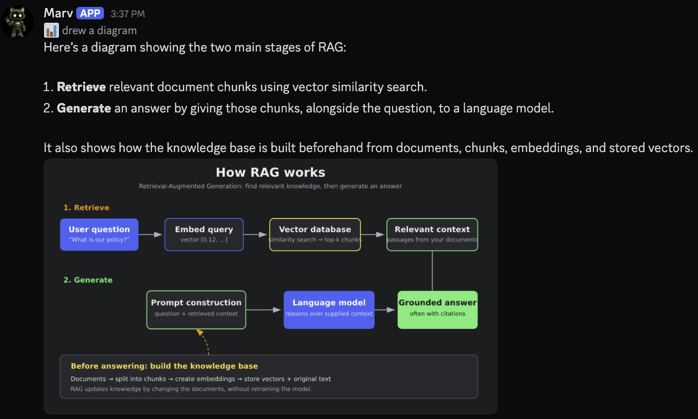

<!-- ═══════════════════════════════════════════════════════ -->
<!--                     BANNER                            -->
<!-- ═══════════════════════════════════════════════════════ -->

  

 

<!-- ═══════════════════════════════════════════════════════ -->
<!--                  STATUS + VIBE                        -->
<!-- ═══════════════════════════════════════════════════════ -->

> 🟢 &nbsp;**actively breaking things** &nbsp;·&nbsp;😭🙏claudee please i needd this..my code is kinda brokenn...&nbsp;·&nbsp; 🏎️MV1
 

<!-- ═══════════════════════════════════════════════════════ -->
<!--                     STACK                             -->
<!-- ═══════════════════════════════════════════════════════ -->

<h2 align="left">stack (honest edition)</h2>

**★ experienced in:**

**the rest of the toolbox:**

 

<!-- ═══════════════════════════════════════════════════════ -->
<!--                    PROJECTS                           -->
<!-- ═══════════════════════════════════════════════════════ -->

<h2 align="left">notable projects</h2>

<table>
  <tr>
    <td width="50%" valign="top">
      <h3><a href="https://bot.silverwolf.dev/">Silverwolf Bot</a></h3>
      
      
Multipurpose shitpost Discord bot. Not safe for work & has gambling. Dockerized though.

      

        
        
        
        
      

      
    </td>
    <td width="50%" valign="top">
      <h3><a href="https://github.com/XeIris/UWA-AI-LocalAiWkshop">AI, Unplugged</a></h3>
      
      
Interactive single-file HTML deck for a 2-hour beginners' workshop on running LLMs locally — no cloud, no subscription, no wi-fi. Live sliders instead of static bullets.

      

        
        
        
      

      
    </td>
  </tr>
  <tr>
    <td width="50%" valign="top">
      <h3><a href="https://github.com/UWA-AI-Club/26W-SIGIL">SIGIL</a></h3>
      
      
Student research on how AI agents coordinate on shared tasks — a deterministic, tag-queried store where agents claim ownership instead of passing context. The measurement is the point: explicit ownership runs <b>3.3× cheaper</b> than naive and reads better too.

      

        
        
        
      

      
    </td>
    <td width="50%" valign="top">
      <h3><a href="https://github.com/XeIris/uwa-ai-marv-discord-bot">AI Discord Chatbots</a></h3>
      
      
Another wrapper, but built specifically for the UWA AI Club. WIP — when deployed it should draw diagrams, assist with general club Q&A, inform about events, and perhaps we might give it agentic capabilities.

      

        
        
        
        
      

      
    </td>
  </tr>
  <tr>
    <td width="50%" valign="top">
      <h3>Minecraft Server Hosting</h3>
      
Private Fabric server for the friend group, fully dockerized — server + automated backup container, RCON, Discord chat bridge, and a pile of perf mods (Lithium, Krypton, FerriteCore). Runs on an OVHcloud VPS: 8&nbsp;GB RAM, 4&nbsp;vCPUs.

      

        
        
        
        
      

      
    </td>
    <td width="50%" valign="top"></td>
  </tr>
</table>

 

<!-- ═══════════════════════════════════════════════════════ -->
<!--              QUOTE + SNAKE + SOCIALS                  -->
<!-- ═══════════════════════════════════════════════════════ -->

> *"Does commits to my README.md count in stats?"*

 

  

 

<h2 align="left">find me</h2>

  
  &nbsp;
  
  &nbsp;
  

 

<!-- ═══════════════════════════════════════════════════════ -->
<!--                   GITHUB STATS                        -->
<!-- ═══════════════════════════════════════════════════════ -->
<h2 align="left">Stats for nerds</h2>

  
  &nbsp;&nbsp;
  

<!-- footer wave -->

  

